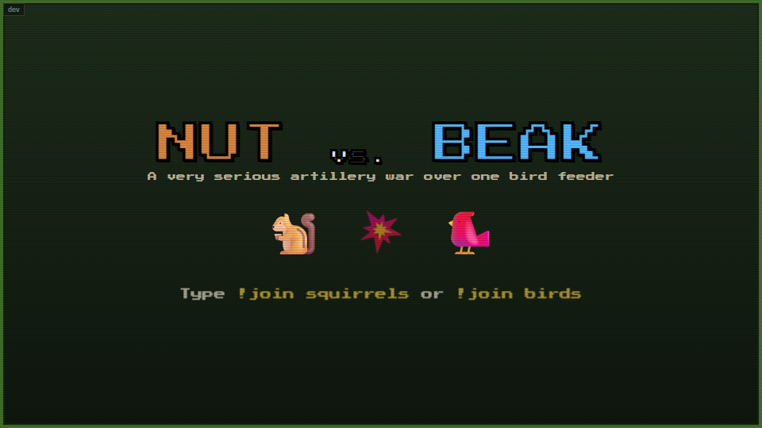
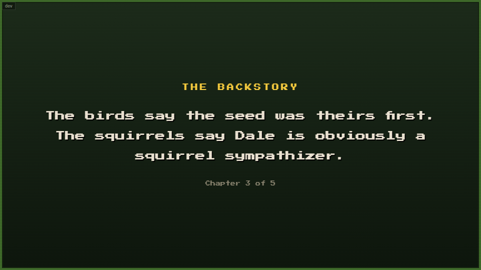
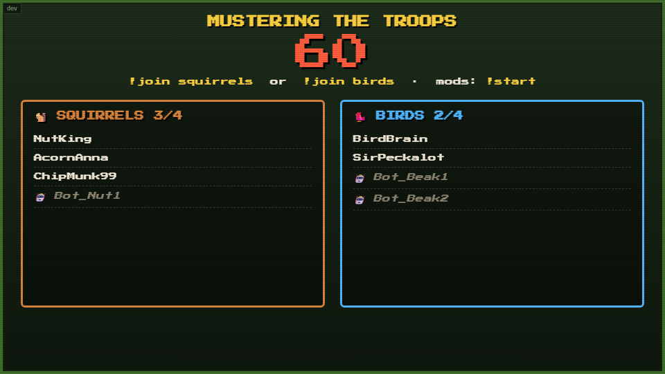
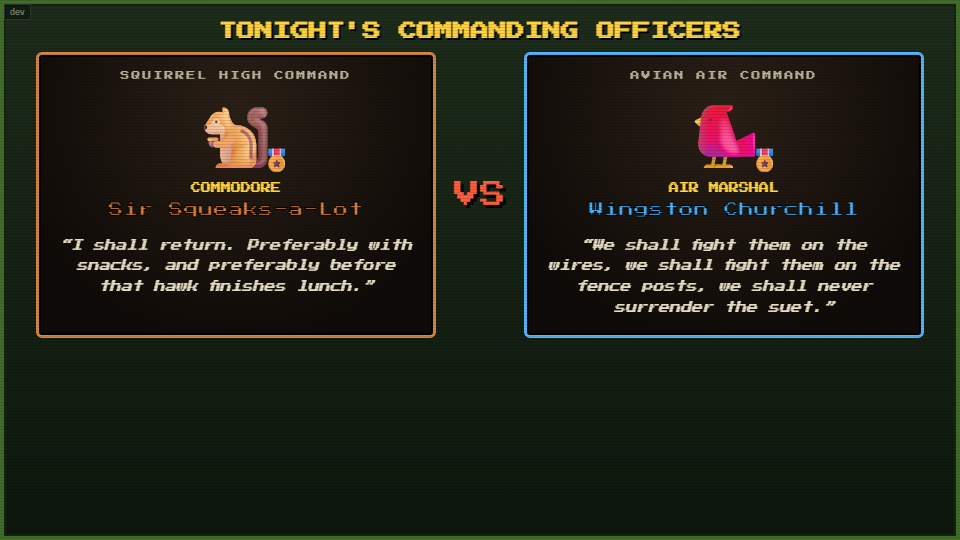
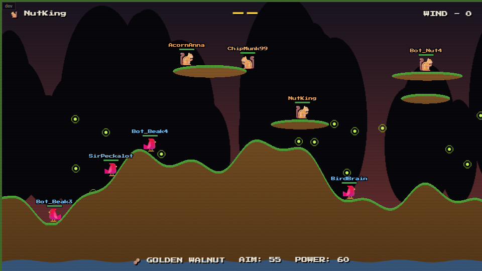
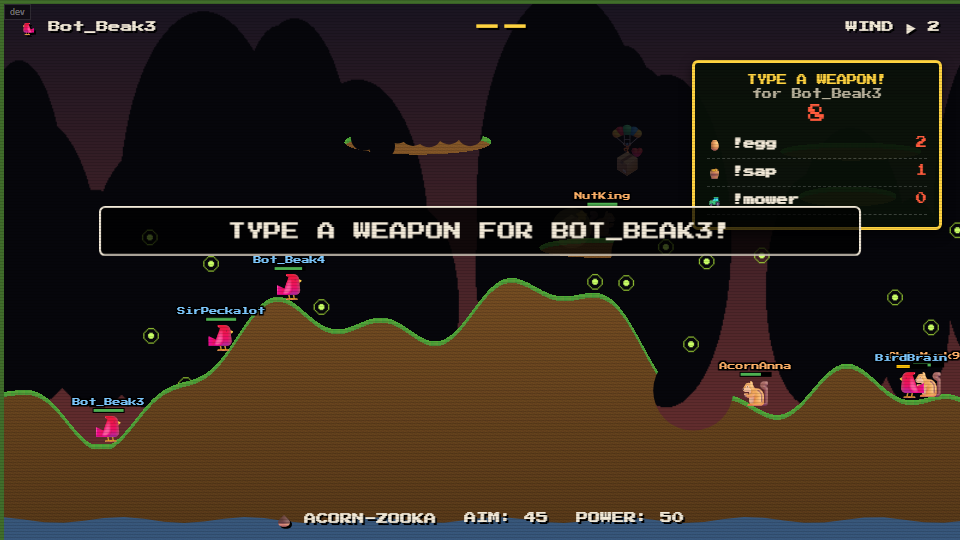
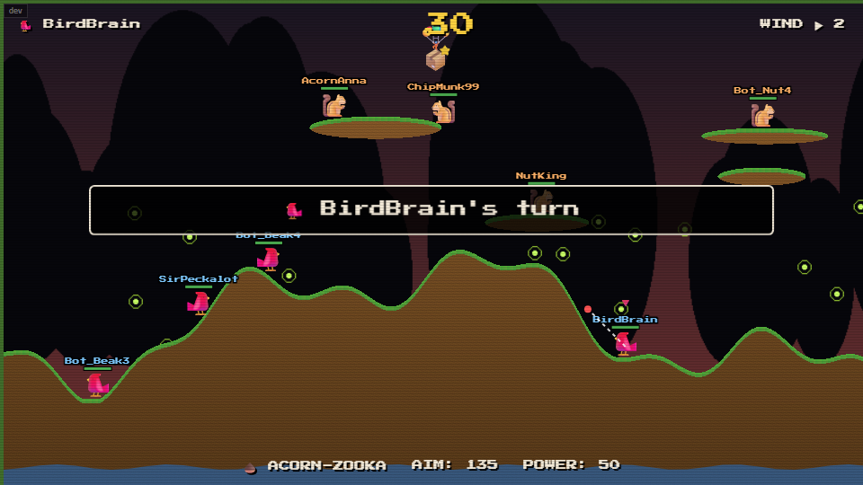
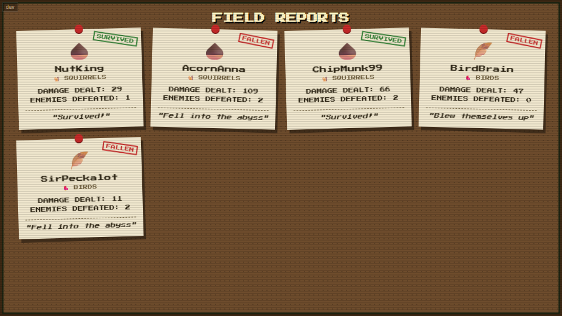

# Nut vs. Beak - Twitch Chat Mini-Game

A zero-setup OBS Browser Source mini-game that parodies *Worms*. Viewers join **Squirrels** or **Birds** by typing a command in chat, bots fill out the teams, and the two armies fight over one bird feeder on destructible terrain with a ridiculous arsenal - Golden Walnuts, Angry Homeowners, Lawn Mowers and more. The last faction standing wins, and every human player gets an **epitaph card** with their stats and a humorous cause of death.

It plays out like a Twitch "spectator" game: chat joins, then **watches it play out by RNG and animation**, stepping in only when the game asks them to **type a weapon** for the next shot.

**There is no backend.** Everything runs in the browser: stats are saved to `localStorage`, and the Twitch channel is set with a URL parameter. That makes it perfect for **GitHub Pages** or just running from your hard drive.

## What's in the game

* **Two factions, four units each.** Humans who `!join` take the slots; bots (`Bot_Nut1`, `Bot_Beak2`...) fill the rest.
* **Destructible pixel terrain.** Explosions really carve the map (custom pixel physics, no physics engine), with gravity and a wind that shifts every turn.
* **33 weapons.** Acorns, exploding eggs, cluster berries, airstrikes by crows, gophers that tunnel, marching ants, a garden gnome, a lawn mower, sprinklers that raise the water and more - see [the arsenal](#the-arsenal).
* **Chat picks the weapon.** Now and then a box appears offering three weapons; whichever chat types most is fired.
* **Supply crates.** Crates parachute in; units make a run for them for health or a big weapon.
* **Commanding officers.** Each side gets a randomly drawn commander with a MacArthur/Twain-style quote before the fight.
* **Attract mode.** The idle screen tells the (deeply serious) backstory of why everyone is fighting over the bird feeder.
* **Epitaph cards** for every human player: faction, damage dealt, enemies defeated, cause of death (or "Survived!").
* **Sound effects.** 31 synthesized sounds (explosions, launches, bounces, crows cawing, the Golden Walnut choir, vote ticks, fanfares...) - generated live, so no audio files. Mute with `?mute=1`.
* **Sudden death.** After turn 20 the water starts rising so a match always finishes.

## 1. Setup & OBS Integration

1. In OBS, add a **Browser Source**.
2. Point it at `index.html` - either tick **Local file**, or paste your GitHub Pages link.
3. **Add your channel to the end of the address** with `?username=`:
   * *Local example:* `file:///H:/PycharmProjects/Nut-vs-Beak/index.html?username=YourChannel`
   * *GitHub Pages example:* `https://YOUR-GITHUB-NAME.github.io/Nut-vs-Beak/?username=YourChannel`
4. Set the source size to **960 x 540**.
5. That's it - no server, no config file, no chroma key.

> If you forget `?username=`, the game quietly falls back to a default channel name (shown in the dev panel as "default"), so double-check the URL before going live. A leading `@` or `#` in the name is stripped for you.
>
> **Sound:** add `&mute=1` to the URL to silence the game (handy if you'd rather run your own music). OBS browser sources play audio automatically; in a normal browser tab, click the page once so the browser allows sound. In OBS, tick **Control audio via OBS** on the Browser Source to get a mixer slider for it.
>
> Stats live in the browser source's local storage, so clearing OBS's browser cache also clears the all-time stats.

### Hosting on GitHub Pages

1. Push this folder to a GitHub repository.
2. **Settings -> Pages -> Build and deployment**: choose **Deploy from a branch**, select `main` and `/ (root)`.
3. After a minute your game is live at `https://YOUR-GITHUB-NAME.github.io/REPO-NAME/`. Use that URL (plus `?username=...`) as the OBS Browser Source.

The game needs internet for two small CDN files (the pixel font and ComfyJS, which reads Twitch chat).

## 2. How a match plays out

1. **Idle / attract mode** - the logo and `!join` prompt alternate with the five-chapter backstory.

   

2. **Lobby** - the first `!join` opens a 60-second lobby. Up to 4 humans per side; empty slots show as 🤖 bots. A mod (or the broadcaster) can type `!start` to begin early.

   

3. **Commanding officers** - a card for each side, like a movie-poster intro.

   

4. **The battle** - turns alternate between sides. Each unit announces its weapon, then fires. Everyone is AI-controlled, so it's a spectator sport.

   

5. **Chat picks a weapon (sometimes)** - on about 40% of turns, chat gets 8 seconds to type one of three offered weapons. Most votes wins (ties and no votes are random). Type it with or without the `!`, e.g. `!egg`, `egg` or `!vote egg`.

   

6. **Supply crates** - a 📦 drifts down on a parachute. A ❤️ crate gives +40 HP (overheal up to 150, shown as a cyan health bar); a ⭐ crate gives that unit a big weapon for its next shot. Units walk toward crates they can reach, and any unit that touches one takes it - enemies included.

   

7. **Epitaph cards** - when one faction is wiped out, every human player gets a card pinned to the corkboard.

   

8. **Results** - the winning commander claims the feeder, then it's back to attract mode.

## 3. Chat commands

| Command | Who | Effect |
|---|---|---|
| `!join squirrels` / `!join birds` | anyone | Enlist on that side (the first join opens the lobby). `!join squirrel` / `!join bird` also work. Names are matched case-insensitively; a full side asks you to pick the other. |
| `!start` | mods / broadcaster | Start the match early instead of waiting out the 60-second lobby. |
| `!<weapon>` | anyone | Only during a weapon vote: type one of the three offered weapon names (`!egg`, `egg`, `!vote egg`). |
| `!stats` | anyone | Shows your all-time games, wins, damage and kills. Only works on the idle screen. |
| `!reset` | broadcaster | Wipes all saved stats. |

## The arsenal

All 33 weapons are in the game. In the default spectator mode the AI picks by weighted odds, chat can vote for them, and weapon crates hand out the big ones; the movement/building tools at the bottom are for manual-control mode.

**Projectiles & explosives**

| Weapon | Command | What it does |
|---|---|---|
| Acorn-zooka | `acorn` | Standard wind-affected shell; explodes on impact. |
| Heat-Seeking Pinecone | `pinecone` | Steers itself around terrain toward an enemy. |
| Rotten Egg | `egg` | Bounces, explodes after 3 seconds, leaves a cloud of green stink. |
| Berry Cluster | `cluster` | Bursts into smaller bouncing berries. |
| Suet Cake | `suet` | Heavy brick that shatters into a dozen bouncy chunks. |
| Golden Walnut | `walnut` | The Holy Hand Grenade: bounces, stops, a ray of sunlight and a chirp, then a huge crater. |
| Firecrackers | `firecracker` | Dropped at the unit's feet with a fuse. |
| Sap Trap | `sap` | Proximity mine; explodes when an enemy steps near. |

**Ranged & melee**

| Weapon | Command | What it does |
|---|---|---|
| Sunflower Seed Spitter | `spitter` | Two fast seeds per turn. |
| Gatling Woodpecker | `woodpecker` | Rapid-fire pecks with heavy recoil. |
| Garden Trowel | `trowel` | Chops an enemy for 50% of their remaining health. |
| Rolled-Up Newspaper | `newspaper` | Swats enemies away. |
| Tail Flick / Beak Poke | `poke` | No damage, just a shove - great near a cliff. |
| Dive Bomb | `dive` | Kamikaze: fly in a line, then explode (the diver is lost). |
| Stolen Bug Spray | `bugspray` | Toxic aerosol stream pushed hard by the wind. |

**Airstrikes, animals & disasters**

| Weapon | Command | What it does |
|---|---|---|
| Flock of Crows | `crows` | Explosive droppings from the sky. |
| Skunk Spray | `skunk` | A line of toxic gas cascading across the map. |
| Gopher Platoon | `gophers` | Gophers dig down through the terrain, then explode. |
| Marching Ants | `ants` | A line of individually exploding ants. |
| Garden Gnome | `gnome` | Indestructible ceramic gnome bounces along, crushing everything. |
| Angry Homeowner | `homeowner` | A giant boot walks in muttering about the lawn, then stomps. *(once per match)* |
| Ceramic Flower Pot | `pot` | Bursts into high-damage terracotta shrapnel. |
| Lawn Mower | `mower` | Catastrophic shower of clippings and mower blades. *(once per match)* |
| Leaf Blower | `blower` | Shoves every unit (and trap) across the map. |
| Turn on the Sprinklers | `sprinklers` | Raises the water and makes everyone "Soggy" (a little damage each turn). *(once per match)* |

**Utility (movement & building tools - only used in manual-control mode, see [Customizing](#5-customizing); Gnawing Teeth is also used by the AI)**

| Weapon | Command | What it does |
|---|---|---|
| Gnawing Teeth | `gnaw` | Chews a tunnel through terrain, hurting anyone in it. |
| Popsicle Stick | `stick` | Builds a wooden bridge. |
| Yo-Yo String | `yoyo` | Zips you to whatever the aim ray hits. |
| Dandelion Seed | `dandelion` | Parachute: slows falls and drifts on the wind. |
| Magical Birdhouse | `birdhouse` | Teleports to a target spot. |
| Hummingbird Wings | `wings` | Short bursts of flight on a stamina meter. |
| Select-a-Critter | `select` | Choose which of your units takes the turn. |
| Play Dead | `playdead` | Forfeit the turn. |

Old names still work as aliases (`bazooka`, `grenade`, `holy`, `banana`, `shotgun`, `flamethrower`, `torch`...).

## 4. Developer / Simulator Mode

Test everything without a live Twitch connection: open the game with `?dev=1` (add it as `&dev=1` if you already have `?username=`), or click the small **`dev`** button in the top-left corner.

A console appears to the right of the game with:

* a mock chat box (username, message, "send as broadcaster/mod"),
* one-click buttons: join squirrels/birds, flood 6 random joins, `!start`, vote for a weapon, skip the commander intro, drop a supply crate, simulate game over, `!stats`, `!reset`, a **Sound** on/off toggle, and a **Sound Test** that plays every effect in turn,
* **Auto-Play Match** - fake chatters fill the lobby, start the match, vote in weapon polls and loop match after match hands-free (great for soak-testing an overlay),
* **Connect to Twitch** - test against real chat while keeping the simulator visible.

The dev panel sits at the right of the 960-pixel stage, so use a browser window at least ~1300 px wide.

## 5. Customizing

Tweak these constants at the top of `game.js` (frames are at 60 fps):

| Constant | Default | What it changes |
|---|---|---|
| `MANUAL_CONTROL` | `false` | `true` restores the original chat-aimed mode: the active player uses `!weapon`, `!aim 0-180`, `!power 1-100`, `!fire`, `!target`, `!move`, `!jump`, `!select`. |
| `VOTE_CHANCE` / `VOTE_SECONDS` | `0.4` / `8` | How often chat gets a weapon vote and how long it stays open. |
| `WEIGHTS` | per weapon | How likely the AI is to pick each weapon (and which weapons chat can be offered). |
| `SUDDEN_DEATH_TURN` | `20` | Turn after which the water starts rising. |
| `CRATE_CHANCE` / `MAX_CRATES` / `CRATE_HEAL` | `0.35` / `2` / `40` | Supply crate frequency and strength. |
| `TURN_INTRO_FRAMES` / `READ_DELAY_FRAMES` | `105` / `90` | Reading pauses between a banner appearing and the action starting. |
| `EMOJI_FACES_LEFT` | `true` | Flip to `false` if your system's squirrel/bird emoji face the wrong way. |

In `twitch.js`: `LOBBY_SECONDS`, `INTRO_MS`, the `OFFICERS` list (add your own commanders and quotes) and the `STORY` chapters for attract mode.

**Backdrops** are generated by `gen_backdrops.py` (needs Python + Pillow: `pip install pillow`). Run it to regenerate the three images in `img/`; one is picked at random each match.

## Files

| File | What it is |
|---|---|
| `index.html` | The page: panels for idle, lobby, intro, battle, epitaph cards and results, plus the dev console. |
| `styles.css` | All styling (VHS grain, cork-board epitaph cards, commander cards, HUD). |
| `twitch.js` | ComfyJS setup, chat parsing, lobby/state machine, commanders, attract mode, stats, epitaph cards, dev tools. |
| `sfx.js` | Synthesized sound effects (Web Audio) and the mute control. To add a sound, add an entry to `SOUNDS` and call `Sfx.play("name")`. |
| `physics.js` | Destructible terrain (canvas + collision mask), raycasts, surface normals. |
| `game.js` | Turn loop, rendering, the weapon registry, bot AI, crates, weapon votes. |
| `gen_backdrops.py` | Generates the backdrop images into `img/`. |
| `img/` | Backdrop images. |
| `screenshots/` | Images used in this README. |

## Notes

* Sprites, weapons and effects are plain emoji drawn on the canvas, so there are no image assets to load besides the backdrops. Hitboxes are simple circles independent of emoji size.
* A match runs a few minutes depending on RNG; sudden death guarantees it finishes.
* Built with vanilla JavaScript, HTML5 Canvas and [ComfyJS](https://github.com/instafluff/ComfyJS) - no build step, no dependencies to install.
